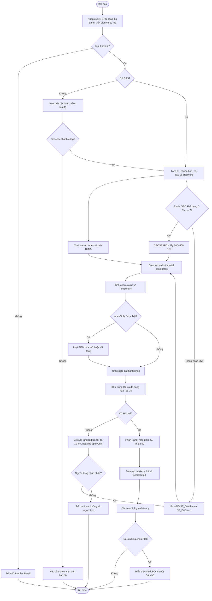

# TravelMap — System Design & Implementation Plan

> Phiên bản: 1.0  
> Ngày cập nhật: 2026-08-24  
> Múi giờ mặc định: `Asia/Ho_Chi_Minh`  
> Trạng thái: Tài liệu thiết kế và kế hoạch triển khai; chưa phải source code hoàn chỉnh.

Tiến độ thực thi được quản lý tự động tại [TRAVELMAP_PIPELINE_PROGRESS.md](/Users/Vinh/Documents/ChatGPT/Travel-TruyVan/TRAVELMAP_PIPELINE_PROGRESS.md) bằng [run_pipeline.sh](/Users/Vinh/Documents/ChatGPT/Travel-TruyVan/run_pipeline.sh). Không chỉnh trạng thái checklist bằng tay; runner sẽ cập nhật sau từng validation.

## 1. Tài liệu nguồn và phạm vi

Plan này được tổng hợp từ:

- [TravelMap.docx](/Users/Vinh/Downloads/TravelMap/TravelMap.docx): bối cảnh, kiến trúc, 5 focused use case, business rule, failover và kế hoạch đánh giá.
- [FocusedUseCases (1).doc](</Users/Vinh/Downloads/TravelMap/FocusedUseCases (1).doc>): mẫu trình bày focused use case.
- [Information Retrieval - B1.pptx](</Users/Vinh/Downloads/TravelMap/Information Retrieval - B1.pptx>): IR pipeline và kiến trúc location-based search.

Phạm vi ưu tiên:

1. **P0 — MVP:** UC1 Authentication, UC5 POI Approval và đặc biệt UC2 Search & Ranking.
2. **P1 — Complete Journey:** UC3 Booking/Payment và UC4 Review.
3. **P2 — Scale:** Redis, RabbitMQ, tách microservice, semantic search và Learning-to-Rank.

Khuyến nghị triển khai ban đầu là **modular monolith** gồm React + Spring Boot + PostgreSQL/PostGIS. Mỗi module vẫn tách Controller / Service / Repository, nhưng chỉ cần một backend deployment. Khi tải và đội ngũ tăng, các module Search, Booking và Payment có thể được tách thành service độc lập mà không thay đổi API công khai.

---

## 2. Context

Người dùng muốn tìm một địa điểm phù hợp dựa trên đồng thời:

- Truy vấn văn bản tự do, ví dụ: `phở ngon`, `quán cà phê yên tĩnh`.
- Vị trí GPS hoặc địa danh nhập tay.
- Thời điểm dự kiến ghé.
- Bán kính, danh mục, mức giá.
- Độ liên quan văn bản, khoảng cách, trạng thái mở cửa và rating.

Pipeline nghiệp vụ cốt lõi:

```text
Query Processing
  → Spatial Retrieval + Text Retrieval
  → Temporal Filter
  → Multi-factor Ranking
  → Diversity Policy
  → Top-K
  → Map/List UI
```

Phạm vi demo:

- Khu vực trung tâm TP.HCM.
- Dữ liệu POI tự soạn hoặc có giấy phép nguồn mở phù hợp.
- Payment gateway giả lập hoặc sandbox.
- Dữ liệu tương tác/người dùng mô phỏng.

---

## 3. Actor

| Actor | Quyền chính |
|---|---|
| Guest | Tìm kiếm, xem kết quả, xem chi tiết POI |
| User | Guest + đặt chỗ, thanh toán, quản lý booking, đánh giá |
| Owner | Tạo/cập nhật POI, theo dõi booking và thống kê POI của mình |
| Admin | Duyệt POI, khóa tài khoản, kiểm duyệt review, báo cáo toàn hệ thống |
| Payment Gateway | Tạo payment URL và gửi webhook trạng thái giao dịch |
| Map/Geocoding Provider | Hiển thị bản đồ và chuyển địa danh thành tọa độ |

Quyền được kiểm soát bằng RBAC ở backend. Frontend chỉ ẩn/hiện chức năng để cải thiện UX, không được coi là lớp bảo mật.

---

## 4. Mục tiêu

### 4.1. P0 — MVP bắt buộc

- Đăng ký/đăng nhập, JWT và RBAC.
- Owner tạo/cập nhật POI; Admin duyệt/từ chối.
- Search bằng `query + GPS + visitAt + filters`.
- Tự cài inverted index và BM25.
- Spatial filtering bằng PostGIS.
- Lọc theo giờ mở cửa.
- Xếp hạng bằng score đa thành phần.
- Trả Top-K dạng bản đồ và danh sách.
- Trả `scoreDetail` để giải thích kết quả.
- Ghi search log và latency.
- Validation nhất quán.
- OpenAPI/Swagger.
- Unit/integration test và test report.

### 4.2. P1 — Hoàn thiện hành trình

- Kiểm tra availability và giữ chỗ 10 phút.
- Payment Adapter và webhook idempotent.
- Thanh toán tại quán hoặc qua sandbox gateway.
- Review sau booking đã hoàn tất.
- Tính lại rating và cập nhật search index.
- Dashboard Owner/Admin.

### 4.3. P2 — Scale và nghiên cứu

- Redis GEO, cache và distributed session.
- RabbitMQ cho `poi.updated`, `review.created`, `booking.paid`.
- Tách Search-IR thành service riêng.
- Vector/semantic retrieval song song BM25.
- Learning-to-Rank và personalization.
- Geofence notification.

---

## 5. Tech stack đề xuất

| Thành phần | Lựa chọn đề xuất |
|---|---|
| Frontend | React + TypeScript + Vite |
| Remote state | TanStack Query |
| UI state | Zustand, chỉ dùng khi thật sự cần |
| Form | React Hook Form + Zod |
| Map | Leaflet + React Leaflet + OpenStreetMap |
| Backend | Java 21 + Spring Boot 4.1 |
| REST API | Spring Web MVC |
| Security | Spring Security, JWT access/refresh token, RBAC |
| Validation | Jakarta Bean Validation + custom validators |
| Data access | Spring Data JPA + native PostGIS query |
| Database migration | Flyway |
| Search IR | Custom inverted index + BM25 bằng Java |
| Vietnamese NLP | `VietnameseTokenizer` interface; adapter cho VnCoreNLP hoặc tokenizer được chọn |
| Database | PostgreSQL + PostGIS |
| Local cache | Caffeine |
| Event trong MVP | Spring Application Events |
| API docs | OpenAPI 3 + Swagger UI qua springdoc-compatible version |
| Backend test | JUnit 5, Mockito, AssertJ, MockMvc, Testcontainers |
| Frontend test | Vitest, React Testing Library, Playwright/Cypress |
| Load test | k6 |
| Local runtime | Docker Compose |
| CI/CD | GitHub Actions |

Spring Boot 4.1 hỗ trợ Java 17–26; Java 21 được chọn vì độ ổn định và hệ sinh thái tốt: [Spring Boot system requirements](https://docs.spring.io/spring-boot/system-requirements.html).

### 5.1. Điều chỉnh so với kiến trúc microservice trong tài liệu

MVP chưa cần Redis, RabbitMQ, NGINX hoặc nhiều backend deployment:

- PostGIS là spatial engine chính.
- Custom BM25 index nằm trong memory và được rebuild khi backend khởi động.
- Spring Application Events thay RabbitMQ.
- Caffeine thay cache Redis.
- Các interface vẫn được tạo ngay từ đầu để có thể chuyển sang Redis/RabbitMQ ở P2.

Lợi ích:

- Ít lỗi hạ tầng hơn.
- Dễ chạy local và deploy free tier.
- Debug transaction Booking/Payment dễ hơn.
- Một người có thể vận hành.
- Không làm mất ranh giới nghiệp vụ giữa các module.

---

## 6. Use case flow

### 6.1. UC1 — Authentication

1. Actor nhập email/password.
2. Hệ thống kiểm tra trạng thái khóa tài khoản.
3. Kiểm tra password hash.
4. Sinh access token 30 phút và refresh token 7 ngày.
5. Trả thông tin actor và role.
6. Sau 5 lần sai trong 15 phút, khóa tài khoản 15 phút.

### 6.2. UC2 — Search & Ranking

1. Guest/User nhập query, GPS/địa danh, thời gian và filter.
2. Validate request.
3. Chuẩn hóa truy vấn tiếng Việt.
4. PostGIS lấy 200–500 POI trong bán kính.
5. Inverted index lấy ứng viên văn bản và tính BM25.
6. Giao hai tập ứng viên.
7. Tính trạng thái mở cửa và `TemporalFit`.
8. Tính score đa thành phần.
9. Khử trùng lặp và đa dạng hóa Top-10.
10. Trả mặc định 20 kết quả, tối đa 50.
11. Ghi search log, latency và phiên bản ranking.

### 6.3. UC3 — Booking & Payment

1. User chọn POI, thời gian, số khách và ghi chú.
2. Hệ thống kiểm tra POI, sức chứa và slot.
3. Tạo booking `PENDING`, giữ chỗ 10 phút.
4. User chọn thanh toán online hoặc tại quán.
5. Nếu online, backend gọi `PaymentGateway` adapter để tạo payment URL.
6. Gateway gửi webhook.
7. Backend xác minh HMAC và idempotency.
8. Booking chuyển `CONFIRMED`; nếu timeout chuyển `EXPIRED`.

### 6.4. UC4 — Review

1. Kiểm tra booking thuộc User và đã `COMPLETED`.
2. Kiểm tra booking chưa có review.
3. Lưu rating, comment và tối đa 5 ảnh.
4. Tính lại `avg_rating`/`rating_count`.
5. Cập nhật search document và index.
6. Cho sửa/xóa trong 24 giờ.

### 6.5. UC5 — POI Management

1. Owner tạo/cập nhật POI.
2. Validate tọa độ, duplicate và opening hours.
3. POI mới mang trạng thái `PENDING_APPROVAL`.
4. Admin duyệt hoặc từ chối kèm lý do.
5. POI được duyệt sẽ vào spatial/BM25 index.
6. Owner/Admin xem báo cáo theo phạm vi quyền.

---

## 7. Business rule

| Rule | Nội dung | Nơi thực thi |
|---|---|---|
| BR 1.1 | 5 lần login sai trong 15 phút → khóa 15 phút | `AuthenticationService` |
| BR 1.2 | Access token 30 phút; refresh token 7 ngày | `TokenService` |
| BR 2.1 | Radius mặc định 2 km, tối đa 10 km | DTO validation |
| BR 2.2 | 200–500 candidates; mặc định 20, tối đa 50 kết quả/trang | `SearchService` |
| BR 2.3 | Khi các score khác tương đương, POI đang mở phải xếp trên POI đóng | `RankingService` |
| BR 2.4 | User dưới 5 tương tác không dùng personalization | P2 |
| BR 2.5 | Kết quả tài trợ phải có nhãn, tối đa 2/Top-10 | `DiversityPolicy` |
| BR 3.1 | Giữ chỗ 10 phút | `BookingService` |
| BR 3.2 | Đặt cọc 10–20% | `DepositPolicy` |
| BR 3.3 | Hoàn cọc nếu hủy trước ít nhất 2 giờ | `RefundPolicy` |
| BR 4.1 | Một booking hoàn tất chỉ được review một lần | Service + unique constraint |
| BR 4.2 | Review chỉ sửa/xóa trong 24 giờ | `ReviewService` |
| BR 5.1 | POI mới phải được Admin duyệt | `PoiApprovalService` |
| BR 5.2 | POI cùng tên phải cách nhau ít nhất 50 m | PostGIS validation |
| BR 5.3 | Search index sai lệch tối đa 10 phút nếu event lỗi | Scheduled re-index |

---

## 8. Database model

### 8.1. Các bảng chính

| Table | Trường quan trọng | Constraint/index |
|---|---|---|
| `app_user` | `id`, `email`, `password_hash`, `role`, `status`, `failed_attempts`, `locked_until` | `email UNIQUE` |
| `category` | `id`, `name`, `slug` | `slug UNIQUE` |
| `poi` | `id`, `owner_id`, `category_id`, `name`, `normalized_name`, `description`, `location`, `address`, `price_level`, `capacity`, `booking_enabled`, `status`, `avg_rating`, `rating_count` | Partial GIST index trên active `location` |
| `poi_opening_hour` | `poi_id`, `day_of_week`, `open_time`, `close_time`, `closed`, `spans_next_day` | Không overlap time range |
| `poi_approval_history` | `poi_id`, `admin_id`, `decision`, `reason`, `created_at` | Audit trail |
| `booking` | `user_id`, `poi_id`, `visit_at`, `party_size`, `status`, `hold_expires_at`, `deposit_amount` | Index `poi_id, visit_at` |
| `payment` | `booking_id`, `gateway`, `external_txn_id`, `idempotency_key`, `amount`, `status`, `paid_at` | Idempotency unique |
| `review` | `booking_id`, `poi_id`, `user_id`, `rating`, `comment`, `status`, `editable_until` | `booking_id UNIQUE`, rating 1–5 |
| `review_image` | `review_id`, `url`, `sort_order` | Tối đa 5 bằng service |
| `poi_search_document` | `poi_id`, `normalized_text`, `document_length`, `indexed_at` | Một document/POI |
| `search_log` | `user_id`, `query_raw`, `query_normalized`, `location`, `radius_km`, `filters`, `result_count`, `latency_ms` | Index theo thời gian |
| `ranking_weight` | `api_version`, `w_bm25`, `w_spatial`, `w_temporal`, `w_rating` | Tổng weight = 1 |

### 8.2. Quan hệ

```text
app_user 1 ── N poi
app_user 1 ── N booking
poi      1 ── N poi_opening_hour
poi      1 ── N booking
booking  1 ── N payment_attempt
booking  1 ── 0..1 review
review   1 ── N review_image
poi      1 ── N review
poi      1 ── 1 poi_search_document
```

`poi.location` dùng `geography(Point,4326)`. Khi tạo point phải truyền theo thứ tự `longitude latitude`.

### 8.3. Search index trong memory

Không cần lưu toàn bộ posting list vào relational table trong MVP:

```text
Map<Term, List<Posting(poiId, termFrequency)>>
Map<PoiId, DocumentLength>
Map<Term, DocumentFrequency>
averageDocumentLength
```

Index được rebuild từ các `poi_search_document` của POI `ACTIVE` khi startup và cập nhật sau sự kiện POI được duyệt hoặc rating thay đổi.

---

## 9. API endpoints

### 9.1. P0

| Method | Endpoint | Actor | Output chính |
|---|---|---|---|
| POST | `/api/v1/auth/register` | Public | User mới |
| POST | `/api/v1/auth/login` | Public | Access/refresh token |
| POST | `/api/v1/auth/refresh` | Public | Access token mới |
| POST | `/api/v1/auth/logout` | User | Revoke refresh token |
| GET | `/api/v1/search` | Guest/User | Top-K POI + score detail |
| GET | `/api/v1/pois/{poiId}` | Public | Chi tiết POI |
| POST | `/api/v1/owner/pois` | Owner | POI pending |
| PUT | `/api/v1/owner/pois/{poiId}` | Owner | POI đã cập nhật |
| GET | `/api/v1/owner/pois` | Owner | POI của Owner |
| PATCH | `/api/v1/admin/pois/{poiId}/approval` | Admin | POI approved/rejected |

### 9.2. P1

| Method | Endpoint | Actor | Output chính |
|---|---|---|---|
| GET | `/api/v1/pois/{poiId}/availability` | User | Các slot còn trống |
| POST | `/api/v1/bookings` | User | Booking pending/confirmed unpaid |
| GET | `/api/v1/bookings/{id}` | User/Owner | Booking detail theo phạm vi quyền |
| POST | `/api/v1/bookings/{id}/payment-sessions` | User | Payment URL |
| POST | `/api/v1/payments/webhooks/{gateway}` | Gateway | `204 No Content` |
| PATCH | `/api/v1/bookings/{id}/cancel` | User | Booking cancelled/refund state |
| POST | `/api/v1/bookings/{id}/reviews` | User | Review mới |
| PATCH | `/api/v1/reviews/{id}` | User | Review đã sửa |
| DELETE | `/api/v1/reviews/{id}` | User | `204 No Content` |
| GET | `/api/v1/owner/reports/overview` | Owner | Owner statistics |
| GET | `/api/v1/admin/reports/overview` | Admin | System statistics |

API documentation:

```text
/swagger-ui/index.html
/v3/api-docs
/v3/api-docs.yaml
```

---

## 10. Business services

### 10.1. SearchService

```text
search(request)
  1. validate request
  2. normalize/tokenize query
  3. retrieve 200–500 spatial candidates
  4. retrieve text candidates from inverted index
  5. intersect candidate sets
  6. calculate and normalize BM25
  7. calculate distance and SpatialDecay
  8. calculate TemporalFit
  9. calculate RatingScore
  10. combine weighted score
  11. apply deduplication/diversity
  12. paginate
  13. log query/latency
  14. return scoreDetail
```

Ranking formula:

```text
score =
  w1 * normalizedBm25
+ w2 * spatialDecay
+ w3 * temporalFit
+ w4 * ratingScore
```

Weight khởi tạo đề xuất cho v1:

```text
BM25          0.40
SpatialDecay  0.30
TemporalFit   0.20
RatingScore   0.10
```

Các weight trên là input cấu hình ban đầu, không phải kết luận khoa học. Chúng cần được tune bằng qrels và so sánh ba cấu hình: BM25-only, distance-only và full score.

### 10.2. Các service khác

| Service | Trách nhiệm |
|---|---|
| `AuthenticationService` | Login, account lock, password policy |
| `TokenService` | Access/refresh token và revoke |
| `PoiService` | CRUD POI, ownership, status transition |
| `PoiApprovalService` | Duyệt/từ chối và audit |
| `SearchIndexService` | Build/update inverted index |
| `QueryProcessingService` | Tokenize, lowercase, bỏ dấu, stopword |
| `RankingService` | BM25, spatial, temporal, rating |
| `DiversityPolicy` | Dedupe brand, category diversity, sponsored limits |
| `BookingService` | Availability, hold, state transition |
| `PaymentService` | Payment adapter, HMAC, idempotency |
| `ReviewService` | Eligibility, moderation, aggregate rating |
| `ReportService` | Search, booking, conversion, revenue |

---

## 11. Validation logic

### 11.1. SearchRequest

- `query`: bắt buộc, trim, 1–200 ký tự.
- `latitude`: `[-90, 90]`.
- `longitude`: `[-180, 180]`.
- `radiusKm`: mặc định 2; từ 0.1 đến 10.
- `visitAt`: hiện tại hoặc tương lai; phải có timezone.
- `page >= 0`.
- `size`: mặc định 20; từ 1 đến 50.
- `priceLevel`: từ 1 đến 4.
- `categoryId`: phải tồn tại nếu được truyền.

### 11.2. POI

- Tên 3–120 ký tự.
- Mô tả tối đa 3.000 ký tự.
- Tọa độ nằm trong vùng demo được cấu hình.
- POI cùng `normalized_name` trong phạm vi dưới 50 m bị cảnh báo/reject.
- `capacity > 0`.
- Opening hours không overlap.
- Owner chỉ cập nhật POI của mình.
- Đổi tọa độ phải chuyển lại `PENDING_APPROVAL`.

### 11.3. Booking/Payment

- POI phải `ACTIVE` và `booking_enabled=true`.
- Thời gian booking ở tương lai.
- `partySize` không vượt sức chứa còn lại.
- Capacity được kiểm tra trong transaction để tránh overbooking.
- Deposit phải nằm trong 10–20%.
- Hết 10 phút, booking chuyển `EXPIRED`.
- Webhook phải có HMAC hợp lệ.
- `idempotencyKey` không được xử lý hai lần.
- Chỉ cho phép state transition hợp lệ.

### 11.4. Review

- Booking phải `COMPLETED`.
- Booking thuộc User hiện tại.
- Mỗi booking chỉ có một review.
- Rating từ 1 đến 5.
- Comment tối đa 2.000 ký tự.
- Tối đa 5 ảnh.
- Chỉ sửa/xóa trước `editable_until`.

### 11.5. Error response

Sử dụng `application/problem+json`:

```json
{
  "type": "/problems/validation-error",
  "title": "Invalid request",
  "status": 400,
  "code": "SEARCH_RADIUS_OUT_OF_RANGE",
  "detail": "radiusKm must be between 0.1 and 10",
  "fieldErrors": {
    "radiusKm": "must be less than or equal to 10"
  }
}
```

---

## 12. Test cases

| ID | Test | Expected |
|---|---|---|
| AUTH-01 | Sai password 5 lần trong 15 phút | Khóa tài khoản 15 phút |
| SEARCH-01 | Không truyền radius | Dùng 2 km |
| SEARCH-02 | Radius 10.1 km | HTTP 400 |
| SEARCH-03 | Page size 51 | HTTP 400 |
| SEARCH-04 | Chuẩn hóa `Cà Phê Yên Tĩnh` | Term lowercase/không dấu đúng |
| SEARCH-05 | BM25 với corpus cố định | Score đúng công thức |
| SEARCH-06 | POI mở và đóng có score khác bằng nhau | POI mở xếp trên |
| SEARCH-07 | POI sắp mở trong 60 phút | `TemporalFit=0.5` |
| SEARCH-08 | Opening hours qua nửa đêm | Open/closed đúng |
| SEARCH-09 | Không có kết quả | Trả suggestion, không tự đổi request |
| SEARCH-10 | In-memory index rebuild | Chỉ POI `ACTIVE` được index |
| POI-01 | Hai POI cùng tên cách 49 m | Reject/cảnh báo duplicate |
| POI-02 | Hai POI cùng tên cách đúng 50 m | Cho phép |
| BOOK-01 | Payment chưa xong sau 10 phút | Booking `EXPIRED` |
| BOOK-02 | Hai request tranh slot cuối | Chỉ một request thành công |
| PAY-01 | Webhook lặp cùng idempotency key | Không xử lý hai lần |
| PAY-02 | HMAC sai | Không đổi booking |
| REVIEW-01 | Review booking chưa completed | HTTP 409 |
| REVIEW-02 | Review lần hai cùng booking | HTTP 409 |
| REVIEW-03 | Sửa review sau 24 giờ | HTTP 403/409 |
| API-01 | DTO không hợp lệ | ProblemDetail đúng schema |

Phân lớp test:

- Unit: JUnit 5 + Mockito cho service/scorer/policy.
- Controller slice: `@WebMvcTest` + MockMvc.
- Repository integration: Testcontainers với PostGIS.
- Frontend component: Vitest + React Testing Library.
- End-to-end: Playwright hoặc Cypress.
- Load: k6.
- IR evaluation: NDCG@10, MAP, P@5.
- Coverage mục tiêu: service ≥ 80%, toàn backend ≥ 70%.

---

## 13. Mermaid activity flow — UC2



---

## 14. Cấu trúc source dự kiến

```text
travelmap/
├── apps/
│   └── web/
│       ├── src/
│       │   ├── api/
│       │   ├── app/
│       │   ├── components/
│       │   ├── features/
│       │   │   ├── auth/
│       │   │   ├── search/
│       │   │   ├── poi/
│       │   │   ├── booking/
│       │   │   ├── payment/
│       │   │   ├── review/
│       │   │   └── administration/
│       │   ├── routes/
│       │   ├── schemas/
│       │   └── test/
│       └── package.json
├── services/
│   └── api/
│       ├── src/main/java/com/travelmap/
│       │   ├── common/
│       │   │   ├── config/
│       │   │   ├── error/
│       │   │   ├── security/
│       │   │   └── validation/
│       │   ├── auth/
│       │   │   ├── controller/
│       │   │   ├── dto/
│       │   │   ├── domain/
│       │   │   ├── repository/
│       │   │   └── service/
│       │   ├── poi/
│       │   ├── search/
│       │   │   ├── controller/
│       │   │   ├── dto/
│       │   │   ├── index/
│       │   │   ├── ranking/
│       │   │   ├── repository/
│       │   │   └── service/
│       │   ├── booking/
│       │   ├── payment/
│       │   ├── review/
│       │   └── report/
│       ├── src/main/resources/
│       │   ├── application.yml
│       │   └── db/migration/
│       └── src/test/
│           ├── unit/
│           ├── integration/
│           └── architecture/
├── infra/
│   ├── docker-compose.yml
│   ├── postgres/
│   └── k6/
├── docs/
│   ├── openapi/
│   ├── adr/
│   └── qrels/
├── .github/workflows/
└── README.md
```

Package theo feature; bên trong từng feature vẫn có Controller / Service / Repository. Cấu trúc này tránh các package toàn cục quá lớn và giữ đường biên tách service sau này.

---

## 15. Input / Output mẫu

### 15.1. Search input

```http
GET /api/v1/search
  ?q=phở ngon
  &lat=10.7723
  &lng=106.6981
  &radiusKm=2
  &visitAt=2026-08-24T19:00:00%2B07:00
  &openOnly=true
  &page=0
  &size=20
```

### 15.2. Search output

```json
{
  "queryId": "853d4233-ae44-4b96-9119-97e67c482682",
  "degradedMode": false,
  "items": [
    {
      "poiId": "667cf35a-5143-49a2-8ad5-d8d4d8b01207",
      "name": "Phở Minh",
      "location": {
        "latitude": 10.7731,
        "longitude": 106.6968
      },
      "distanceMeters": 380,
      "openStatus": "OPEN",
      "score": 0.834,
      "scoreDetail": {
        "bm25": 0.81,
        "spatialDecay": 0.74,
        "temporalFit": 1.0,
        "ratingScore": 0.88,
        "weights": {
          "bm25": 0.4,
          "spatial": 0.3,
          "temporal": 0.2,
          "rating": 0.1
        }
      }
    }
  ],
  "page": 0,
  "size": 20,
  "total": 12,
  "suggestions": []
}
```

### 15.3. Booking input

```json
{
  "poiId": "667cf35a-5143-49a2-8ad5-d8d4d8b01207",
  "visitAt": "2026-08-25T19:00:00+07:00",
  "partySize": 4,
  "note": "Bàn gần cửa sổ",
  "paymentMethod": "MOCK_GATEWAY"
}
```

### 15.4. Booking output

```json
{
  "bookingId": "c55ab695-1aaa-47a6-a708-74590912d0eb",
  "status": "PENDING",
  "holdExpiresAt": "2026-08-24T20:10:00+07:00",
  "depositAmount": 200000,
  "currency": "VND",
  "paymentRequired": true
}
```

### 15.5. POI create input/output

Input:

```json
{
  "name": "Cà phê Bờ Sông",
  "description": "Không gian yên tĩnh, có bàn ngoài trời",
  "categoryId": "cafe",
  "latitude": 10.778,
  "longitude": 106.702,
  "priceLevel": 2,
  "capacity": 60,
  "bookingEnabled": true,
  "openingHours": [
    {
      "dayOfWeek": 1,
      "openTime": "07:00",
      "closeTime": "22:00"
    }
  ]
}
```

Output:

```json
{
  "poiId": "db27857b-73c3-41c8-94dc-bd243170111e",
  "status": "PENDING_APPROVAL",
  "createdAt": "2026-08-24T20:00:00+07:00"
}
```

---

## 16. Plan triển khai từng bước

Mỗi milestone dưới đây bắt buộc có **Input → Work → Output → Acceptance**, tránh tình trạng hoàn thành code nhưng không có đầu ra kiểm chứng được.

### Milestone 0 — Chốt requirement và acceptance criteria

#### Input cần có

- Phạm vi chọn P0 hay P0+P1.
- Vùng demo hoặc polygon phục vụ.
- Quyết định guest có được search hay không.
- Quyết định payment mock hay sandbox thật.
- Branding tối thiểu: tên, màu, logo hoặc cho phép dùng placeholder.
- Bộ dữ liệu POI mẫu hoặc quyền tự tạo seed.

#### Work

- Chốt use case, out-of-scope và error semantics.
- Chốt default ranking weights.
- Chốt status/state transition.
- Ghi ADR cho modular monolith.

#### Output

- Requirement baseline đã duyệt.
- Acceptance checklist.
- ERD/API draft.
- Danh sách assumption có version.

#### Acceptance

- Không còn quyết định nghiệp vụ P0 có thể làm đổi database/API lớn.

### Milestone 1 — Foundation

#### Input

- Java version, Node version.
- Tên package/group/artifact.
- Quyền cài dependency và chạy Docker.

#### Work

- Khởi tạo monorepo React/Spring Boot.
- Docker Compose với PostGIS.
- Flyway baseline.
- Global ProblemDetail handler.
- OpenAPI/Swagger.
- Logging, Actuator health check.
- GitHub Actions build/test.

#### Output

- `apps/web` build thành công.
- `services/api` build thành công.
- `docker compose up` chạy database/backend.
- `/actuator/health = UP`.
- Swagger UI truy cập được.
- CI xanh.

#### Acceptance

- Một developer mới clone repo và chạy được theo README.

### Milestone 2 — Database, Auth, RBAC

#### Input

- Role list.
- Admin seed email.
- Password policy.
- JWT secret hoặc phương án key pair.

#### Work

- Migration user/category/POI skeleton.
- Register/login/refresh/logout.
- Account lock.
- RBAC method/endpoint security.
- Unit và controller test.

#### Output

- Token hợp lệ.
- Endpoint Owner/Admin bị chặn đúng role.
- Lock rule hoạt động.
- Không có secret trong Git.

#### Acceptance

- Test AUTH-01 và security matrix pass.

### Milestone 3 — POI Management & Approval

#### Input

- Category list.
- Service area.
- Opening-hour conventions.
- CSV/JSON seed POI.

#### Work

- POI CRUD.
- Geometry/geography mapping.
- Opening hours.
- Duplicate check trong 50 m.
- Admin approve/reject.
- Audit history.
- Seed/import command.

#### Output

- Owner tạo được POI pending.
- Admin duyệt được POI.
- Chỉ POI active xuất hiện ở public API.
- Seed database có 100–1.000 POI.

#### Acceptance

- POI-01/POI-02 pass.
- Spatial index được sử dụng trong query plan.

### Milestone 4 — Search IR Core

#### Input

- Stopword list.
- Quyết định tokenizer.
- Ranking weights.
- 30–50 query đánh giá và qrels 0–3, hoặc quyền tự tạo.

#### Work

- Query normalization.
- Inverted index.
- BM25 scorer.
- PostGIS candidate retrieval.
- Temporal filter.
- Multi-factor ranking.
- Diversity policy.
- Search logs và score details.
- Rebuild/incremental index.

#### Output

- Search API chạy end-to-end.
- Score có thể giải thích.
- Báo cáo BM25-only, distance-only, full score.
- NDCG@10/MAP/P@5 report.

#### Acceptance

- SEARCH-01 đến SEARCH-10 pass.
- Full score không bị regression nghiêm trọng so với baseline trên qrels đã duyệt.

### Milestone 5 — React Map UI

#### Input

- Branding/theme.
- Map tile/geocoding choice.
- Wireframe được duyệt hoặc quyền tự thiết kế.

#### Work

- Search form và validation.
- GPS permission/fallback địa danh.
- Map marker cluster.
- List/map synchronization.
- Filters, pagination và empty state.
- POI detail và score breakdown.
- Auth/Owner/Admin routes.

#### Output

- UI responsive.
- Search từ UI tới backend hoạt động.
- Lỗi API hiển thị rõ.
- Có loading/cold-start state.

#### Acceptance

- E2E: search → select marker → POI detail pass.

### Milestone 6 — Booking & Payment

#### Input

- Capacity model.
- Deposit percent.
- Cancellation/refund policy.
- Mock/sandbox gateway credentials.
- Webhook callback URL.

#### Work

- Availability.
- Transactional hold.
- Booking state machine.
- Payment adapter.
- HMAC/idempotent webhook.
- Expiry scheduler.
- Cancel/refund.

#### Output

- Booking giữ chỗ đúng 10 phút.
- Mock/sandbox payment hoàn thành.
- Webhook replay không tạo side effect lần hai.

#### Acceptance

- BOOK-01/02 và PAY-01/02 pass.

### Milestone 7 — Review & Reporting

#### Input

- Moderation policy.
- Image storage credentials.
- Reporting dimensions.

#### Work

- Review eligibility.
- Image upload.
- Edit/delete 24 giờ.
- Rating aggregate.
- Re-index POI.
- Owner/Admin report.

#### Output

- Review flow end-to-end.
- Rating ảnh hưởng search result.
- Dashboard đúng phạm vi dữ liệu.

#### Acceptance

- REVIEW-01/02/03 pass.
- Owner không xem được dữ liệu Owner khác.

### Milestone 8 — Hardening, QA và Deployment

#### Input

- Hosting accounts.
- Domain nếu có.
- Environment secrets.
- Budget ceiling.
- Quyền deploy và kết nối Git repository.

#### Work

- Unit/integration/E2E/load tests.
- Security headers, CORS, rate limit.
- Database migration cloud.
- Frontend/backend deployment.
- Monitoring và budget alerts.
- Backup/export procedure.

#### Output

- Demo URL frontend.
- API URL và Swagger.
- Cloud database.
- CI/CD tự động.
- Test/IR/load reports.
- Runbook rollback/restore.

#### Acceptance

- Smoke test production-like environment pass.
- Không có secret trong repository/log.
- Có quy trình export/backup trước demo.

---

## 17. Master checklist

### Requirement

- [ ] Chốt P0/P1/P2.
- [ ] Chốt service area.
- [ ] Chốt Guest/User/Owner/Admin permissions.
- [ ] Chốt ranking weights ban đầu.
- [ ] Chốt payment mock/sandbox.
- [ ] Chốt acceptance criteria.

### Repository/Foundation

- [ ] Tạo monorepo.
- [ ] React + TypeScript + Vite.
- [ ] Spring Boot + Java 21.
- [ ] Docker Compose/PostGIS.
- [ ] Flyway migrations.
- [ ] ProblemDetail handler.
- [ ] OpenAPI/Swagger.
- [ ] Actuator health.
- [ ] GitHub Actions.
- [ ] README local setup.

### Auth/RBAC

- [ ] Register/login/refresh/logout.
- [ ] Password hashing.
- [ ] Account lock.
- [ ] RBAC tests.
- [ ] Secret handling.

### POI

- [ ] Category.
- [ ] POI CRUD.
- [ ] Opening hours.
- [ ] PostGIS GIST index.
- [ ] Duplicate 50 m rule.
- [ ] Approval workflow.
- [ ] Audit history.
- [ ] Seed/import.

### Search

- [ ] Tokenizer abstraction.
- [ ] Normalization/stopwords.
- [ ] Inverted index.
- [ ] BM25 tests.
- [ ] Spatial candidates.
- [ ] TemporalFit.
- [ ] Ranking weights/versioning.
- [ ] Diversity policy.
- [ ] Score details.
- [ ] Search logs.
- [ ] Index rebuild/update.
- [ ] Qrels and IR evaluation.

### Frontend

- [ ] Search form.
- [ ] GPS permission.
- [ ] Geocoding fallback.
- [ ] Map markers/clusters.
- [ ] List/map sync.
- [ ] Filters/pagination.
- [ ] POI detail.
- [ ] Empty/error/loading state.
- [ ] Owner/Admin screens.
- [ ] Responsive/accessibility pass.

### Booking/Payment

- [ ] Availability.
- [ ] Capacity transaction.
- [ ] Hold expiry.
- [ ] Deposit policy.
- [ ] Payment adapter.
- [ ] HMAC/idempotency.
- [ ] Cancel/refund.

### Review/Report

- [ ] Completed-booking eligibility.
- [ ] One review/booking.
- [ ] Edit/delete 24 giờ.
- [ ] 5-image limit.
- [ ] Rating aggregate/re-index.
- [ ] Owner/Admin reports.

### Quality/Deployment

- [ ] Unit test coverage.
- [ ] Repository integration tests.
- [ ] Frontend component tests.
- [ ] E2E tests.
- [ ] k6 load test.
- [ ] Security/CORS/rate-limit review.
- [ ] Cloud database migration.
- [ ] Frontend/backend deployment.
- [ ] Monitoring/budget alerts.
- [ ] Backup/export/rollback runbook.

---

## 18. Permission cần để hoàn thành

### 18.1. Quyền local/workspace

| Permission | Khi nào cần | Lý do |
|---|---|---|
| Ghi file trong repository | Ngay khi bắt đầu code | Tạo source, config, test, migration |
| Chạy build/test | Mọi milestone | Xác minh code |
| Chạy Docker | Foundation/integration | PostGIS, integration test |
| Tải dependency qua mạng | Lần build đầu/cập nhật | Maven/npm/Docker images |
| Tạo branch/commit | Nếu user yêu cầu quản lý Git | Lưu lịch sử thay đổi |

### 18.2. Quyền external/cloud

Các quyền dưới đây **không được tự suy ra**; cần user cho phép khi đến bước tương ứng:

- Tạo/kết nối GitHub repository.
- Tạo Supabase project và chạy migration.
- Kết nối Cloudflare Pages/Render/Koyeb/Cloud Run với repository.
- Thêm environment variables/secrets.
- Tạo Upstash Redis ở P2.
- Cấu hình domain/DNS.
- Tạo payment sandbox application và webhook.
- Gửi email/thông báo ra ngoài.
- Deploy hoặc thay đổi production/demo environment.

### 18.3. Secrets cần cung cấp qua secret manager/env

Không gửi vào source code hoặc commit:

```text
DATABASE_URL
DATABASE_USERNAME
DATABASE_PASSWORD
JWT_SECRET hoặc JWT_PRIVATE_KEY/JWT_PUBLIC_KEY
SUPABASE_URL
SUPABASE_ANON_KEY
SUPABASE_SERVICE_ROLE_KEY  # backend only
PAYMENT_GATEWAY_SECRET
PAYMENT_WEBHOOK_SECRET
REDIS_URL                  # P2
REDIS_TOKEN                # P2
```

Nguyên tắc:

- `service_role` chỉ ở backend secret store.
- Frontend chỉ dùng key được phép public, nếu thực sự dùng Supabase client.
- Log không ghi token, password, HMAC secret hoặc full webhook payload nhạy cảm.
- Tạo `.env.example`, không commit `.env` thật.

---

## 19. Information cần từ user

### Bắt buộc trước khi code P0

1. Chọn phạm vi: chỉ P0 hay P0+P1.
2. Tên chính thức và branding tối thiểu.
3. Polygon/khu vực demo.
4. Danh sách category.
5. Dữ liệu POI mẫu hoặc quyền tự tạo seed.
6. Guest có được search không.
7. Admin seed account.
8. Chấp thuận ranking weights đề xuất hoặc cung cấp weights khác.
9. Chấp thuận Java 21 + Spring Boot modular monolith.
10. Chọn database cloud: Supabase hoặc Neon.

### Cần trước P1

1. Capacity tính theo tổng POI hay theo slot.
2. Deposit mặc định chính xác bao nhiêu phần trăm.
3. Chính sách cancel/refund.
4. Gateway mock hay VNPay/MoMo/ZaloPay sandbox.
5. Quy tắc tự chuyển booking sang `COMPLETED`.
6. Quy tắc moderation review.

### Cần trước deploy

1. GitHub repository/organization.
2. Hosting accounts.
3. Budget tối đa/tháng.
4. Domain nếu có.
5. Ai giữ quyền Owner/Admin của cloud projects.
6. Demo data có được public không.
7. Yêu cầu backup/retention.
8. Có chấp nhận cold start của free backend không.

Nếu các thông tin chưa có, implementation có thể dùng assumption đã ghi rõ trong ADR và cấu hình hóa để đổi sau.

---

## 20. Tool, hosting và giá tham khảo

> Giá/quota được kiểm tra ngày 2026-08-24 và có thể thay đổi. Luôn kiểm tra lại trang chính thức trước khi tạo tài nguyên hoặc nhập thẻ thanh toán.

### 20.1. Tool phát triển — ưu tiên free

| Tool | Mục đích | Giá đề xuất |
|---|---|---|
| Git | Version control | Free |
| GitHub Free | Repository, issue, PR | $0; public/private repo |
| GitHub Actions | CI/CD | Public repo free; GitHub Free private có 2.000 phút/tháng |
| Docker Desktop/Engine | Local services | Free tùy điều khoản sử dụng phù hợp |
| IntelliJ IDEA Community hoặc VS Code | Java/React IDE | Free |
| Postman/Bruno/Insomnia | API test | Dùng bản free; Bruno phù hợp lưu collection trong Git |
| Swagger UI | API docs | Free/open source |
| DBeaver Community | Database client | Free |
| k6 | Load test | Free khi chạy local |
| JUnit/Mockito/Testcontainers | Backend tests | Free/open source |
| Vitest/RTL/Playwright | Frontend/E2E tests | Free/open source |

GitHub Free hiện có unlimited public/private repositories và 2.000 Actions phút/tháng; Actions cho public repository dùng standard runner miễn phí. Nguồn: [GitHub pricing](https://github.com/pricing), [GitHub Actions included usage](https://docs.github.com/en/billing/reference/product-usage-included).

### 20.2. Database/storage

#### Khuyến nghị: Supabase Free

- Giá: `$0/tháng` cho demo/hobby.
- 500 MB database/project.
- 1 GB file storage.
- 5 GB egress.
- PostGIS enable từ dashboard.
- Free project có thể pause sau một tuần không hoạt động.
- Không có automatic backup trên Free.

Nguồn: [Supabase pricing](https://supabase.com/pricing), [Supabase PostGIS](https://supabase.com/docs/guides/database/extensions/postgis).

Phù hợp với:

- Demo có 100–1.000 POI.
- Ảnh review nhỏ.
- Không yêu cầu SLA production.

#### Alternative: Neon Free

- Giá: `$0/tháng`.
- 0.5 GB storage/project.
- PostGIS extension.
- Có branching/time-travel giới hạn.

Nguồn: [Neon pricing](https://neon.com/pricing).

### 20.3. Frontend hosting

#### Khuyến nghị: Cloudflare Pages Free

- Giá: `$0/tháng`.
- 500 builds/tháng.
- Một build tại một thời điểm.
- 100 projects/account.
- 20.000 files/site, 25 MiB/file.

Nguồn: [Cloudflare Pages limits](https://developers.cloudflare.com/pages/platform/limits/).

Alternative: Render Static Site hoặc Vercel Free; cần kiểm tra lại quota/điều khoản tại thời điểm deploy.

### 20.4. Backend hosting

#### Option A — Render Free, dễ demo

- Giá: `$0/tháng`.
- 750 free instance hours/workspace/tháng.
- Spin down sau 15 phút không có traffic.
- Lần request tiếp theo có thể mất khoảng một phút để spin up.
- Filesystem ephemeral; không lưu ảnh/database trên local disk.
- Không dùng cho production.

Nguồn: [Render free services](https://render.com/docs/free).

Ưu điểm: kết nối GitHub và deploy container/JAR đơn giản.  
Nhược điểm: cold start và RAM free tier có thể chật cho Spring Boot + NLP model; cần tối ưu JVM và có loading state ở frontend.

#### Option B — Koyeb Free

- Giá: `$0/tháng` cho một free web instance.
- 512 MB RAM, 0.1 vCPU, 2 GB SSD.
- Scale to zero sau một giờ không traffic.
- Chỉ một free instance/organization; chỉ một số region.

Nguồn: [Koyeb instances](https://www.koyeb.com/docs/reference/instances).

#### Option C — Google Cloud Run

- Có free monthly allowance theo CPU/RAM request usage.
- Scale to zero, container-based.
- Thường yêu cầu billing account/card và cấu hình phức tạp hơn.
- Có thể phát sinh phí egress hoặc vượt free allowance.

Nguồn: [Cloud Run pricing](https://cloud.google.com/run/pricing).

### 20.5. Redis ở P2

Upstash Redis Free:

- `$0/tháng`.
- 256 MB.
- 500.000 commands/tháng.
- 10 GB bandwidth/tháng.
- Phù hợp cache/session/demo; không có production SLA trên free tier.

Nguồn: [Upstash Redis pricing](https://upstash.com/pricing/redis).

### 20.6. RabbitMQ/message broker

MVP dùng Spring Application Events, chi phí `$0` và không cần cloud broker.

Khi P2:

- Local/demo: RabbitMQ trong Docker Compose, `$0`.
- Online: chọn managed broker sau khi có traffic requirement; kiểm tra pricing tại thời điểm triển khai.
- Không thêm broker chỉ để “đúng kiến trúc” nếu chưa cần retry, DLQ và độc lập deployment.

### 20.7. Ba cấu hình ngân sách

| Cấu hình | Thành phần | Chi phí dự kiến | Dùng cho |
|---|---|---:|---|
| Local | Docker Compose + local PostGIS + local frontend/backend | `$0/tháng` | Phát triển, test, bảo vệ đồ án offline |
| Demo Free | Cloudflare Pages + Render/Koyeb Free + Supabase Free + GitHub Free | Gần `$0/tháng` | Demo, portfolio, giảng viên review |
| Demo ổn định hơn | Cloudflare Pages Free + backend paid entry tier + Supabase Free/Pro tùy dữ liệu | Từ vài USD đến khoảng `$25+`/tháng | Tránh cold start, demo nhiều người |

Khuyến nghị ban đầu: **Local + Demo Free**. Chỉ nâng cấp backend trước buổi demo nếu cold start hoặc 512 MB không đáp ứng. Không nhập thẻ hoặc bật pay-as-you-go nếu chưa thiết lập budget cap/alert.

---

## 21. Definition of Done và kết quả cuối

### 21.1. Kết quả bàn giao

- React web responsive cho desktop/mobile.
- Bản đồ marker cluster và danh sách Top-K.
- Spring Boot API đúng Controller / Service / Repository.
- PostgreSQL/PostGIS migrations và seed data.
- Custom inverted index + BM25; không dùng Elasticsearch/Lucene thay cho phần IR phải tự cài.
- Search result có `scoreDetail`.
- Swagger/OpenAPI đầy đủ request, response và error.
- Validation ở frontend, DTO, service và database.
- Unit/integration/E2E/load tests.
- Báo cáo NDCG@10, MAP, P@5 so với baseline.
- Docker Compose cho local.
- Cloud demo theo phương án đã duyệt.
- README, architecture decisions và runbook.

### 21.2. Input cuối cùng của hệ thống

- POI/category/opening-hour dataset.
- User/role/admin seed.
- Search query + coordinates + visit time + filters.
- Ranking configuration.
- Booking/payment/review commands.
- Environment secrets và cloud config.

### 21.3. Output cuối cùng của hệ thống

- Top-K POI có map coordinates, distance, open status và score detail.
- POI detail.
- Booking/payment/review state có audit.
- Owner/Admin reports theo đúng phạm vi quyền.
- Search quality metrics và test reports.
- API docs và deploy URLs.

### 21.4. Tiêu chí nghiệm thu

- [ ] Default radius 2 km; không vượt 10 km.
- [ ] Default page size 20; không vượt 50.
- [ ] Chỉ POI active được public/search.
- [ ] Ranking formula và `scoreDetail` khớp nhau.
- [ ] POI open/closed hoạt động cả lịch qua nửa đêm.
- [ ] Duplicate 50 m đúng boundary.
- [ ] Booking không overbook trong concurrent test.
- [ ] Payment webhook idempotent.
- [ ] Một booking chỉ có một review.
- [ ] Owner/Admin data isolation pass.
- [ ] Swagger và CI luôn xanh ở commit bàn giao.
- [ ] Không có secret trong Git/history/log.
- [ ] Demo URL chạy được hoặc có local fallback trước buổi trình bày.

---

## 22. Rủi ro và phương án giảm thiểu

| Rủi ro | Ảnh hưởng | Giảm thiểu |
|---|---|---|
| Tokenizer tiếng Việt kém | BM25 sai relevance | Adapter tokenizer, corpus test và qrels |
| Qrels chủ quan | Metric thiếu tin cậy | Hướng dẫn label, thêm người label nếu có thể |
| Free backend cold start | Demo chậm/lỗi timeout | Warm-up trước demo, loading state, local fallback |
| Supabase Free pause/no backup | Mất thời gian demo/khôi phục | Wake-up trước demo, `pg_dump` thủ công |
| 512 MB backend RAM | Spring Boot/NLP OOM | JVM memory flags, lazy model, tokenizer nhẹ hoặc paid backend |
| Overbooking | Mất tính đúng đắn | Transaction/locking và concurrency test |
| Webhook replay | Double payment/update | HMAC + idempotency unique constraint |
| Rating manipulation | Ranking sai | Bayesian rating/verified booking; anomaly detection để P2 |
| Secret lộ | Security incident | Secret manager, scan, rotate, không log |
| Scope quá lớn | Không hoàn thành lõi IR | Đóng băng P0 trước, P1/P2 sau |

---

## 23. Quyết định khuyến nghị để bắt đầu

Nếu user chưa thay đổi yêu cầu, dùng baseline sau:

```text
Scope:             P0 trước, P1 sau
Architecture:      Modular monolith
Frontend:          React + TypeScript + Vite
Backend:           Java 21 + Spring Boot 4.1
Database local:    PostgreSQL/PostGIS Docker
Database cloud:    Supabase Free
Frontend hosting:  Cloudflare Pages Free
Backend hosting:   Render Free, có local fallback
Redis/RabbitMQ:    Chưa dùng ở P0
Payment:           Mock Adapter ở P1
Service area:      Trung tâm TP.HCM
Search page size:  Default 20, max 50
Search radius:     Default 2 km, max 10 km
Ranking v1:        0.40 BM25 / 0.30 spatial / 0.20 temporal / 0.10 rating
```

Baseline này tối ưu cho việc hoàn thành đồ án, kiểm chứng IR và duy trì chi phí gần `$0` trong giai đoạn phát triển/demo.
